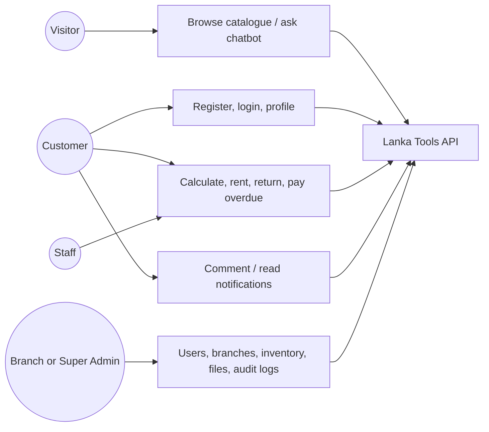
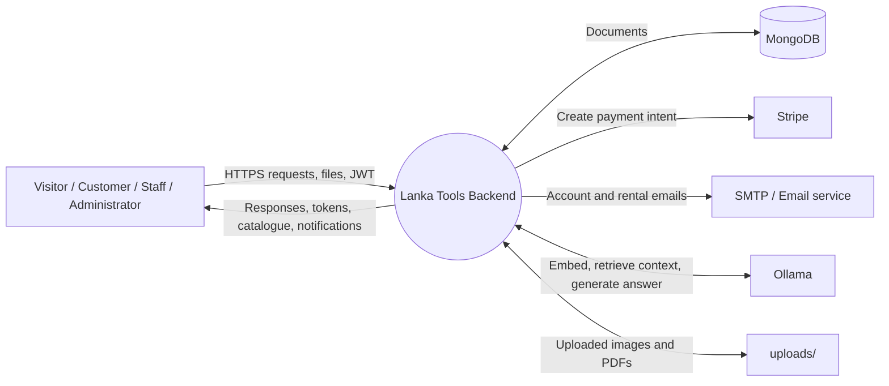
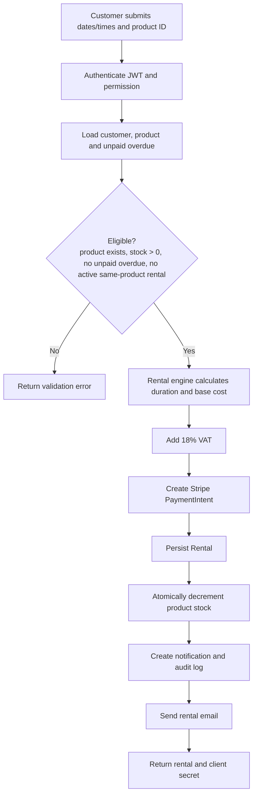
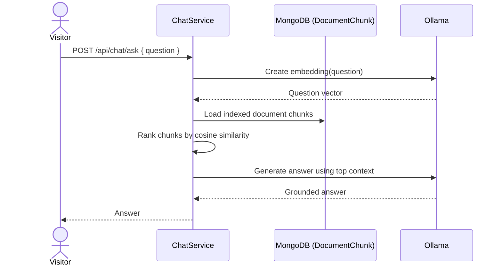
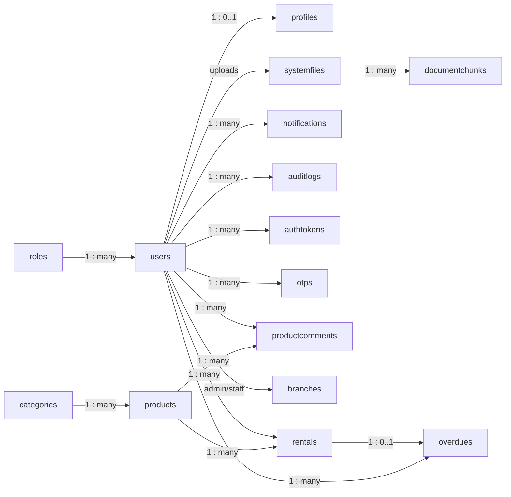

# Lanka Tools Backend — Functional Design

## 1. Purpose and scope

Lanka Tools is a tool-rental backend. It supports public catalogue browsing, customer accounts and tool rentals, and staff/admin operations for inventory, branches, users, documents, and audit history. This design reflects the implemented NestJS backend under `src/`.

**Technology boundary:** NestJS REST API, MongoDB/Mongoose, JWT authentication, Stripe PaymentIntents, Nodemailer, local `uploads/` storage, and an Ollama-based RAG/chat integration. A scheduled task evaluates overdue rentals daily.

## 2. Actors and use cases

| Actor | Main use cases |
|---|---|
| Visitor | Browse public tools, view a public tool, ask the public document chatbot |
| Customer | Register/login, maintain profile, calculate and create rentals, return tools, view/pay late fees, comment on products, read notifications and audit history |
| Staff | View permitted product/rental data and process permitted returns |
| Branch administrator | Staff functions plus assigned-branch administration (subject to role permissions) |
| Super administrator | Manage users, platform users, branches/staff assignments, products/categories, system documents and audit logs |
| Stripe | Creates payment intents for rentals |
| Email service | Sends account, rental, overdue, payment and assignment notices |
| Ollama service | Produces embeddings and grounded/document or dashboard AI responses |

Permissions are data-driven: a `User` references a `Role`, and the role holds allowed permission strings. Controllers apply `JwtAuthGuard` and `PermissionsGuard` to protected operations.



## 3. Backend component UML


## 4. Data-flow diagrams

### Level 0: system context



### Level 1: create-rental flow



## 5. Entity relationship design

MongoDB is document-oriented, so the diagram shows Mongoose references rather than relational foreign keys. All timestamped schemas also contain `createdAt` and `updatedAt`.

```mermaid
erDiagram
  ROLE ||--o{ USER : assigns
  USER ||--|| PROFILE : owns
  USER ||--o{ AUTH_TOKEN : has
  USER ||--o{ OTP : receives
  USER ||--o{ BACKUP_CODES : owns
  USER ||--o{ NOTIFICATION : receives
  USER ||--o{ AUDIT_LOG : creates
  USER ||--o{ RENTAL : makes
  USER ||--o{ PRODUCT_COMMENT : writes
  USER ||--o{ SYSTEM_FILE : uploads
  USER ||--o{ BRANCH : administers
  BRANCH }o--o{ USER : staff_members
  CATEGORY ||--o{ PRODUCT : groups
  PRODUCT ||--o{ RENTAL : rented_in
  PRODUCT ||--o{ PRODUCT_COMMENT : receives
  PRODUCT ||--o{ OVERDUE : relates_to
  RENTAL ||--o| OVERDUE : may_create
  USER ||--o{ OVERDUE : owes
  SYSTEM_FILE ||--o{ DOCUMENT_CHUNK : split_into

  ROLE {
    string role PK
    string_array permissions
  }
  USER {
    objectid id PK
    string email UK
    objectid role FK
    string password
    boolean account_stats
  }
  PROFILE {
    objectid id PK
    objectid user FK_UK
    string first_name
    string mobile
    object address
  }
  BRANCH {
    objectid id PK
    objectid branch_admin FK
    string branch_name
    string branch_address
    objectid_array staff_members FK
  }
  CATEGORY {
    objectid id PK
    string category
    string category_desc
    boolean category_stats
  }
  PRODUCT {
    objectid id PK
    objectid category FK
    string product
    number hourly_price
    number daily_price
    number weekly_price
    number stock
    boolean product_status
  }
  RENTAL {
    objectid id PK
    objectid user FK
    objectid product FK
    datetime startDateTime
    datetime endDateTime
    number totalAmount
    boolean is_returned
  }
  OVERDUE {
    objectid id PK
    objectid user FK
    objectid product FK
    objectid rentel FK
    number override_cost
    boolean is_pay_overdue
  }
  PRODUCT_COMMENT {
    objectid id PK
    objectid product FK
    objectid user FK
    objectid parent_comment FK
    string comment
  }
  NOTIFICATION {
    objectid id PK
    objectid user FK
    string title
    string status
    string type
  }
  AUDIT_LOG {
    objectid id PK
    objectid user FK
    string action
    string description
    string ipAddress
  }
  AUTH_TOKEN {
    objectid id PK
    objectid user FK
    string refresh_token_hash
    datetime expire_at
  }
  OTP {
    objectid id PK
    objectid user FK
    string otp
    boolean is_used
    datetime expire_at
  }
  BACKUP_CODES {
    objectid id PK
    objectid user FK
    string_array backup_codes
  }
  SYSTEM_FILE {
    objectid id PK
    objectid uploader FK
    string filename
    string mime_type
    string path
  }
  DOCUMENT_CHUNK {
    objectid id PK
    objectid fileId FK
    number chunkIndex
    string text
    number_array embedding
  }
```

## 6. Key sequence diagrams

### Rental creation and payment preparation

```mermaid
sequenceDiagram
  actor C as Customer
  participant API as RentalController/Service
  participant DB as MongoDB
  participant P as Stripe
  participant M as Email + Notifications
  C->>API: POST /api/rentel/create-rental/:productId (Bearer JWT, dates/times)
  API->>DB: Verify user; check overdue, product, stock and active rental
  DB-->>API: Eligible user/product
  API->>API: Calculate price + 18% VAT
  API->>P: Create PaymentIntent(totalAmount)
  P-->>API: intent ID, client secret, status
  API->>DB: Create Rental; decrement stock; create audit/notification
  API->>M: Send rental confirmation
  API-->>C: Rental details + payment client secret
```

### RAG document question



## 7. Principal REST interface

| Area | Route prefix | Functional operations |
|---|---|---|
| Authentication | `/api/auth` | Register, login, refresh/logout, backup-code login, password-reset OTP verification and update |
| Profile | `/api/profile` | Update/fetch profile, change password, list/read notifications, view own audits |
| Products | `/api/product` | CRUD-like category/product creation and update, status toggles, protected views, public catalogue/detail, create/list comments |
| Rentals | `/api/rentel` | Calculate cost, create/list/view/return rentals, list/view/request payment/clear late fees, current-user rentals/fees |
| Administration | `/api/admin` | User status and lookup, branch and staff assignment, platform users, audit logs, system file upload/list |
| Chat | `/api/chat` | Public document Q&A and protected dashboard AI generation |

Protected endpoints receive `Authorization: Bearer <JWT>`. Uploaded profile/category/system files use single-file multipart form-data; product creation/update accepts up to ten files.

## 8. Business rules implemented

- A user cannot rent while any overdue record remains unpaid.
- A product must exist and have stock; stock is reduced on rental creation and restored when returned.
- A user cannot create another active rental of the same product.
- Rental totals are calculated from hourly/daily/weekly pricing and include a fixed **18% VAT** in the current service implementation.
- Returning a late rental creates an `Overdue` record; payment clearing requires the full accumulated overdue amount.
- A daily cron job checks past-end-date rentals and sends overdue emails.
- Product/category/user status flags allow enable/disable behavior without a delete endpoint.
- Sensitive/account, rental, administration, and profile-changing operations record audit context such as IP address and user agent.

## 9. Design notes for implementation and assessment

- The API listens on `PORT` (default `3000`), serves local files at `/uploads/`, validates and whitelists DTO input, and enables configured CORS.
- The model currently records a Stripe PaymentIntent ID in the response/email flow, but no payment entity or webhook confirmation endpoint is present. If payment settlement must be auditable, add a `Payment` collection and Stripe webhook processing.
- The scheduled overdue-email job calculates and emails overdue information. The return workflow is where an `Overdue` document is persisted.
- Route spelling is implemented as `/api/rentel`; clients and any future API specification should retain or deliberately migrate this spelling.

## 10. Proposed database design (collections, relationships and schemas)

The proposed database is **MongoDB** because the backend already uses Mongoose. “Tables” below refer to MongoDB collections. Each collection uses `_id: ObjectId` as its primary identifier and, unless noted otherwise, should use Mongoose timestamps (`createdAt`, `updatedAt`). References are stored as `ObjectId` values and populated only when required by a use case.

### 10.1 Collection schema catalogue

| Collection (table) | Purpose | Key fields and constraints |
|---|---|---|
| `roles` | Defines access levels and permissions. | `role` **unique**, enum: `super_admin`, `branch_admin`, `staff`, `customer`; `permissions: string[]` |
| `users` | Authentication and account status. | `email` **unique, required**; `role` → `roles`; `password` (bcrypt hash); `last_login`; `login_ip`; `account_stats: boolean` |
| `profiles` | Optional personal/contact information, separated from login data. | `user` → `users`, **unique**; names, mobile, address, billing address, DOB, image, bio |
| `branches` | Physical/service branch details and staff allocation. | `branch_admin` → `users`; branch name, address, Google location; `staff_members: ObjectId[]` → `users` |
| `categories` | Product classification. | category, image path, description, `sub_category: string[]`, `category_stats: boolean` |
| `products` | Rental inventory. | `category` → `categories`; name, description, image paths, hourly/daily/weekly prices, discount, stock, tags, `product_status` |
| `rentals` | A customer’s rental transaction. | `user` → `users`; `product` → `products`; copied price snapshot, start/end times, duration units, subtotal, VAT, total, `is_returned` |
| `overdues` | Late return charge raised against a rental. | `user` → `users`; `product` → `products`; `rentel` → `rentals`; `override_cost >= 0`; `is_pay_overdue` |
| `productcomments` | Product comments and threaded replies. | `product` → `products`; `user` → `users`; nullable `parent_comment` → same collection; comment text |
| `notifications` | In-app user messages. | `user` → `users`; title, description; status enum `Read`/`Unread`; type enum `System`/`Notice`/`Separate` |
| `auditlogs` | Accountability for important actions. | `user` → `users`; action, description, IP address, user agent, flexible metadata object |
| `authtokens` | Refresh-token/session records. | `user` → `users`; hashed refresh token; expiry; device/IP/user agent |
| `otps` | Temporary password-reset/verification codes. | `user` → `users`; OTP, `is_used`, expiry; TTL index deletes expired records |
| `backupcodes` | Recovery login codes. | `user` → `users`; `backup_codes: string[]` (stored securely/hashed in a hardened implementation) |
| `systemfiles` | PDFs/documents available to the assistant. | `uploader` → `users`; original name, stored name **unique**, MIME type, size, upload path |
| `documentchunks` | Searchable chunks from system documents. | `fileId` → `systemfiles`; chunk index, text, embedding vector |

### 10.2 Logical relationship diagram



### 10.3 Validation, indexes and integrity rules

| Area | Proposed rule |
|---|---|
| Identity | Unique indexes on `users.email`, `roles.role`, `profiles.user`, and `systemfiles.filename`. Never return password hashes, refresh-token hashes, OTPs, or backup codes in API responses. |
| Authentication | Index `authtokens.user` and `expire_at`; create TTL index on `otps.expire_at`. Hash passwords and refresh tokens. |
| Catalogue | Index `products.category`, `products.product_status`, and optionally product tags/text for public search. Require prices and stock to be non-negative. |
| Rental operations | Index `rentals.user`, `rentals.product`, `rentals.endDateTime`, `rentals.is_returned`; index `overdues.user` plus `is_pay_overdue` to quickly block a customer with unpaid fees. |
| Relationships | Check referenced user/product/category/rental exists before writing. Prevent a second active rental for the same customer/product. |
| Stock consistency | In a MongoDB transaction where deployment supports it, create rental and decrement stock together; otherwise use the existing conditional update `{ stock: { $gt: 0 } }` and check that it modified one document. |
| Payments | Add a future `payments` collection containing `rental`, Stripe intent ID **unique**, amount, currency, payment status and webhook timestamps. Update it only from verified Stripe webhooks. |
| AI documents | Index `documentchunks.fileId`; use a vector index if MongoDB Atlas Vector Search is adopted, otherwise retain application-side cosine similarity for small datasets. |

## 11. Test plan

### 11.1 Test scope and approach

Testing covers the REST backend, MongoDB persistence, protected routes, uploads, external-service boundaries, and the primary customer/admin workflows. Automated API tests should use a separate test database, mock Stripe/Ollama/SMTP where deterministic results are needed, and clean test data after each suite.

| Test level | Objective | Suggested tools/evidence |
|---|---|---|
| Unit test | Verify isolated calculations and utility rules. | Jest: rental engine, overdue engine, token/permission helpers, vector similarity |
| Integration/API test | Verify controller → service → database behavior. | Jest + Supertest + isolated MongoDB test database |
| Black-box test | Test visible API behaviour from requests and responses without relying on source code. | Postman collection / Supertest; expected HTTP status, body and DB result |
| Dry run | Manually walk through representative end-to-end scenarios using controlled data. | Test-data sheet, timestamps, screenshots and resulting records |
| Usability test | Assess whether intended users can complete frontend-assisted API tasks clearly and safely. | Task script, observation sheet, SUS questionnaire |

### 11.2 Black-box test cases

| ID | Feature | Input / precondition | Expected result |
|---|---|---|---|
| BB-01 | Register | Valid unused email and valid password | Account/profile/role-related registration succeeds; duplicate email is rejected |
| BB-02 | Login | Correct credentials | Returns usable access and refresh tokens; audit/session data is created |
| BB-03 | Login rejection | Wrong password or inactive account | Authentication fails; no valid token is issued |
| BB-04 | Authorization | Customer token calls admin product-create endpoint | Request is denied (401/403); no product is created |
| BB-05 | Public catalogue | Call `GET /api/product/public-products` without token | Active/public product list is returned |
| BB-06 | Product upload | Authorized user submits product plus 1–10 valid images | Product and upload paths are stored; invalid/oversized file is rejected |
| BB-07 | Cost calculation | Known price and fixed rental dates/times | Correct duration, subtotal, 18% VAT and total are returned |
| BB-08 | Successful rental | In-stock product; customer has no unpaid overdue | Rental and Stripe intent are created; stock reduces by one; notification/audit entry exists |
| BB-09 | Out-of-stock rental | Product stock = 0 | Rental rejected; no payment intent/rental record; stock remains zero |
| BB-10 | Duplicate active rental | Same customer already has non-returned/current rental for product | Second rental rejected; no extra stock reduction |
| BB-11 | Unpaid overdue restriction | Customer has `is_pay_overdue = false` overdue record | New rental rejected with overdue-payment message |
| BB-12 | Return on time | Active rental returned before due time | Rental marked returned; stock increases once; no overdue created |
| BB-13 | Late return | Active rental returned after due time | Rental marked returned; stock increases; overdue record/notification created |
| BB-14 | Clear late fees | Amount is less than accumulated unpaid overdue | Request rejected; late fees remain unpaid |
| BB-15 | Notifications | Owner marks own unread notification as read | Status changes to `Read`; another user cannot alter it |
| BB-16 | RAG chat | Question relevant to uploaded/indexed document | Returns a response based on retrieved document chunks; invalid/empty question is rejected |

### 11.3 Dry-run scenarios

Perform the following manually with a known test administrator, customer, category and product. Record request/response, key database values, email/notification evidence and final status.

| Dry run | Steps | Expected checkpoints |
|---|---|---|
| DR-01: customer rental | Login customer → view public product → calculate a 2-day rental → create rental → complete Stripe test payment if client is available | Price matches rate; VAT is 18%; one rental exists; stock changes `n → n-1`; customer notification, email and audit log exist |
| DR-02: normal return | Use DR-01 rental before end time → return tool | `is_returned=true`; stock returns `n-1 → n`; no unpaid overdue exists |
| DR-03: late return | Create a rental whose end date is in the past in test data → return it | Overdue amount is calculated; overdue document is unpaid; customer receives notice; new rental attempt is blocked |
| DR-04: clear overdue | Attempt partial payment → attempt exact full payment | Partial payment rejected; exact total clears all applicable fees and enables later rental |
| DR-05: administrator workflow | Login admin → create category → create product/images → create branch → assign staff → inspect audit log | Each resource is persisted, files are accessible under `/uploads/`, assigned staff appears in branch, actions are audited |
| DR-06: document assistant | Admin uploads a supported PDF → chunks/embeddings are created → visitor asks a question grounded in the PDF | System file and chunks exist; answer is relevant to document; unrelated question does not invent operational facts |

### 11.4 Usability testing schema

Usability testing is performed with representative users through the client application that consumes this API. Use at least 5 participants if possible: 3 customers, 1 staff member and 1 administrator. Obtain consent, use test accounts only, and do not collect real payment or personal data.

| Field | Definition |
|---|---|
| Participant ID / role | Anonymous code, e.g. `P01-Customer`, `P04-Staff` |
| Task | Example: find a drill, calculate a rental, complete a rental, return a tool, pay a fee, add a product |
| Success | `Complete`, `Complete with help`, or `Fail` |
| Completion time | Seconds from task start to correct completion |
| Errors | Wrong route/action, validation failure, abandoned attempt, or incorrect interpretation |
| Assistance | Number/type of prompts given by facilitator |
| Severity | 1 = cosmetic, 2 = minor delay, 3 = serious friction, 4 = task blocker |
| User quote/observation | Exact comment or observed hesitation/confusion |
| Satisfaction | 1–5 rating immediately after each task |

Suggested tasks and acceptance targets:

| Task | Role | Target |
|---|---|---|
| Register/log in and locate an available tool | Customer | At least 80% complete unaided in 3 minutes |
| Calculate and submit a one-day rental | Customer | At least 80% complete unaided in 4 minutes; price/VAT understood by at least 80% |
| Locate a notification and determine its status | Customer | At least 90% complete unaided in 1 minute |
| Return a rented tool and understand an overdue result | Staff | At least 90% complete unaided in 2 minutes |
| Add category/product with images | Administrator | At least 80% complete unaided in 5 minutes |
| Find an audit entry for an administrative action | Administrator | At least 80% complete unaided in 2 minutes |

After the tasks, collect the standard 10-question System Usability Scale (SUS). A mean score of **68 or above** is an acceptable baseline; issues rated severity 3 or 4 should be resolved and the affected task retested before release.
