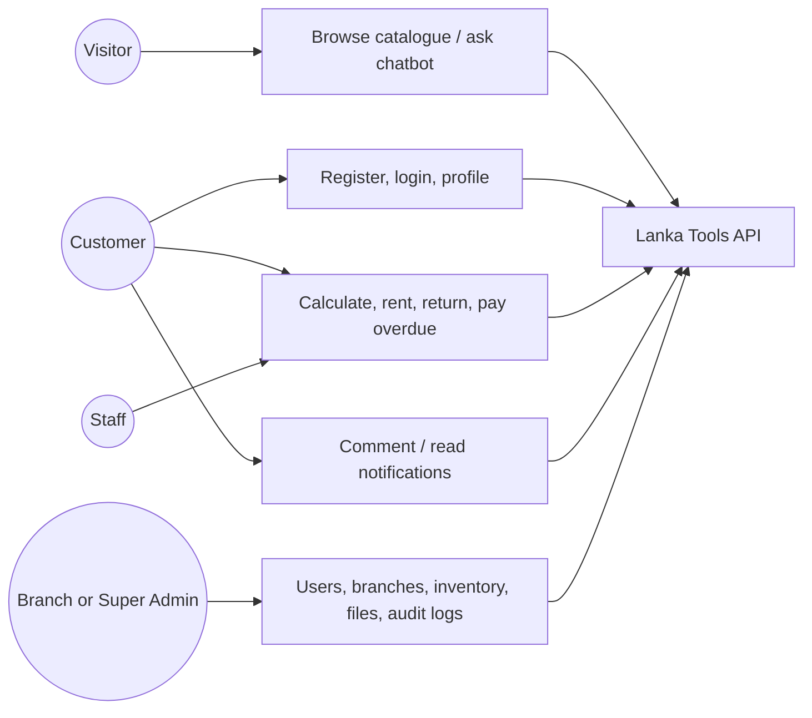
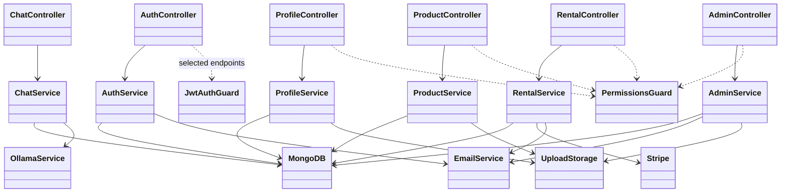
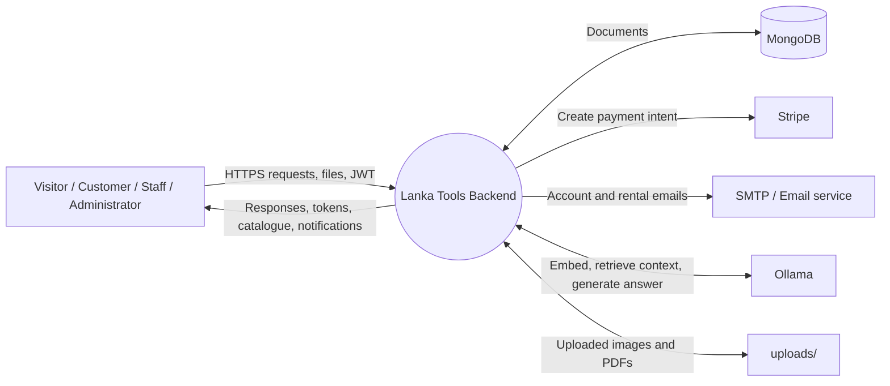
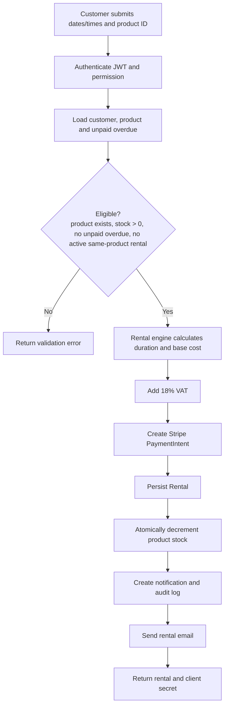
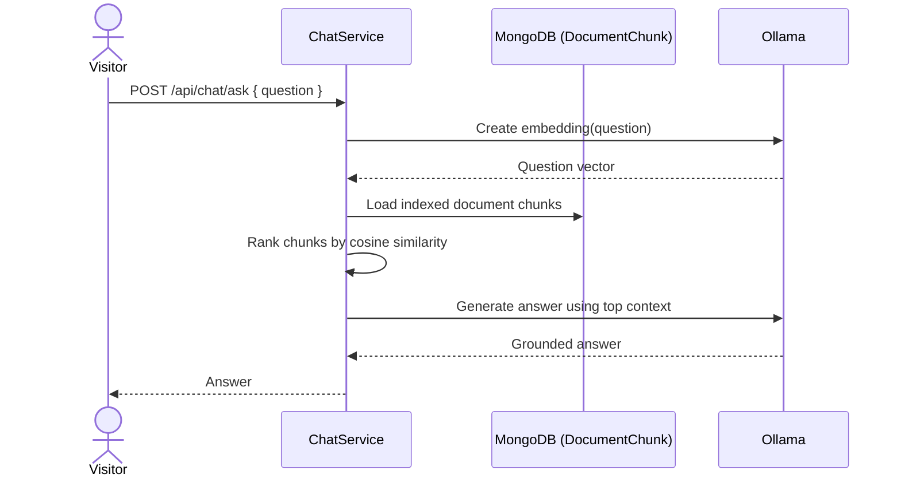

# Lanka Tools Backend — Functional Design

## 1. Purpose and scope

Lanka Tools is a tool-rental backend. It supports public catalogue browsing, customer accounts and tool rentals, and staff/admin operations for inventory, branches, users, documents, and audit history. This design reflects the implemented NestJS backend under `src/`.

**Technology boundary:** NestJS REST API, MongoDB/Mongoose, JWT authentication, Stripe PaymentIntents, Nodemailer, local `uploads/` storage, and an Ollama-based RAG/chat integration. A scheduled task evaluates overdue rentals daily.

## 2. Actors and use cases

| Actor | Main use cases |
|---|---|
| Visitor | Browse public tools, view a public tool, ask the public document chatbot |
| Customer | Register/login, maintain profile, calculate and create rentals, return tools, view/pay late fees, comment on products, read notifications and audit history |
| Staff | View permitted product/rental data and process permitted returns |
| Branch administrator | Staff functions plus assigned-branch administration (subject to role permissions) |
| Super administrator | Manage users, platform users, branches/staff assignments, products/categories, system documents and audit logs |
| Stripe | Creates payment intents for rentals |
| Email service | Sends account, rental, overdue, payment and assignment notices |
| Ollama service | Produces embeddings and grounded/document or dashboard AI responses |

Permissions are data-driven: a `User` references a `Role`, and the role holds allowed permission strings. Controllers apply `JwtAuthGuard` and `PermissionsGuard` to protected operations.



## 3. Backend component UML



## 4. Data-flow diagrams

### Level 0: system context



### Level 1: create-rental flow



## 5. Entity relationship design

MongoDB is document-oriented, so the diagram shows Mongoose references rather than relational foreign keys. All timestamped schemas also contain `createdAt` and `updatedAt`.

```mermaid
erDiagram
  ROLE ||--o{ USER : assigns
  USER ||--|| PROFILE : owns
  USER ||--o{ AUTH_TOKEN : has
  USER ||--o{ OTP : receives
  USER ||--o{ BACKUP_CODES : owns
  USER ||--o{ NOTIFICATION : receives
  USER ||--o{ AUDIT_LOG : creates
  USER ||--o{ RENTAL : makes
  USER ||--o{ PRODUCT_COMMENT : writes
  USER ||--o{ SYSTEM_FILE : uploads
  USER ||--o{ BRANCH : administers
  BRANCH }o--o{ USER : staff_members
  CATEGORY ||--o{ PRODUCT : groups
  PRODUCT ||--o{ RENTAL : rented_in
  PRODUCT ||--o{ PRODUCT_COMMENT : receives
  PRODUCT ||--o{ OVERDUE : relates_to
  RENTAL ||--o| OVERDUE : may_create
  USER ||--o{ OVERDUE : owes
  SYSTEM_FILE ||--o{ DOCUMENT_CHUNK : split_into

  ROLE {
    string role PK
    string_array permissions
  }
  USER {
    objectid id PK
    string email UK
    objectid role FK
    string password
    boolean account_stats
  }
  PROFILE {
    objectid id PK
    objectid user FK_UK
    string first_name
    string mobile
    object address
  }
  BRANCH {
    objectid id PK
    objectid branch_admin FK
    string branch_name
    string branch_address
    objectid_array staff_members FK
  }
  CATEGORY {
    objectid id PK
    string category
    string category_desc
    boolean category_stats
  }
  PRODUCT {
    objectid id PK
    objectid category FK
    string product
    number hourly_price
    number daily_price
    number weekly_price
    number stock
    boolean product_status
  }
  RENTAL {
    objectid id PK
    objectid user FK
    objectid product FK
    datetime startDateTime
    datetime endDateTime
    number totalAmount
    boolean is_returned
  }
  OVERDUE {
    objectid id PK
    objectid user FK
    objectid product FK
    objectid rentel FK
    number override_cost
    boolean is_pay_overdue
  }
  PRODUCT_COMMENT {
    objectid id PK
    objectid product FK
    objectid user FK
    objectid parent_comment FK
    string comment
  }
  NOTIFICATION {
    objectid id PK
    objectid user FK
    string title
    string status
    string type
  }
  AUDIT_LOG {
    objectid id PK
    objectid user FK
    string action
    string description
    string ipAddress
  }
  AUTH_TOKEN {
    objectid id PK
    objectid user FK
    string refresh_token_hash
    datetime expire_at
  }
  OTP {
    objectid id PK
    objectid user FK
    string otp
    boolean is_used
    datetime expire_at
  }
  BACKUP_CODES {
    objectid id PK
    objectid user FK
    string_array backup_codes
  }
  SYSTEM_FILE {
    objectid id PK
    objectid uploader FK
    string filename
    string mime_type
    string path
  }
  DOCUMENT_CHUNK {
    objectid id PK
    objectid fileId FK
    number chunkIndex
    string text
    number_array embedding
  }
```

## 6. Key sequence diagrams

### Rental creation and payment preparation

```mermaid
sequenceDiagram
  actor C as Customer
  participant API as RentalController/Service
  participant DB as MongoDB
  participant P as Stripe
  participant M as Email + Notifications
  C->>API: POST /api/rentel/create-rental/:productId (Bearer JWT, dates/times)
  API->>DB: Verify user; check overdue, product, stock and active rental
  DB-->>API: Eligible user/product
  API->>API: Calculate price + 18% VAT
  API->>P: Create PaymentIntent(totalAmount)
  P-->>API: intent ID, client secret, status
  API->>DB: Create Rental; decrement stock; create audit/notification
  API->>M: Send rental confirmation
  API-->>C: Rental details + payment client secret
```

### RAG document question



## 7. Principal REST interface

| Area | Route prefix | Functional operations |
|---|---|---|
| Authentication | `/api/auth` | Register, login, refresh/logout, backup-code login, password-reset OTP verification and update |
| Profile | `/api/profile` | Update/fetch profile, change password, list/read notifications, view own audits |
| Products | `/api/product` | CRUD-like category/product creation and update, status toggles, protected views, public catalogue/detail, create/list comments |
| Rentals | `/api/rentel` | Calculate cost, create/list/view/return rentals, list/view/request payment/clear late fees, current-user rentals/fees |
| Administration | `/api/admin` | User status and lookup, branch and staff assignment, platform users, audit logs, system file upload/list |
| Chat | `/api/chat` | Public document Q&A and protected dashboard AI generation |

Protected endpoints receive `Authorization: Bearer <JWT>`. Uploaded profile/category/system files use single-file multipart form-data; product creation/update accepts up to ten files.

## 8. Business rules implemented

- A user cannot rent while any overdue record remains unpaid.
- A product must exist and have stock; stock is reduced on rental creation and restored when returned.
- A user cannot create another active rental of the same product.
- Rental totals are calculated from hourly/daily/weekly pricing and include a fixed **18% VAT** in the current service implementation.
- Returning a late rental creates an `Overdue` record; payment clearing requires the full accumulated overdue amount.
- A daily cron job checks past-end-date rentals and sends overdue emails.
- Product/category/user status flags allow enable/disable behavior without a delete endpoint.
- Sensitive/account, rental, administration, and profile-changing operations record audit context such as IP address and user agent.

## 9. Design notes for implementation and assessment

- The API listens on `PORT` (default `3000`), serves local files at `/uploads/`, validates and whitelists DTO input, and enables configured CORS.
- The model currently records a Stripe PaymentIntent ID in the response/email flow, but no payment entity or webhook confirmation endpoint is present. If payment settlement must be auditable, add a `Payment` collection and Stripe webhook processing.
- The scheduled overdue-email job calculates and emails overdue information. The return workflow is where an `Overdue` document is persisted.
- Route spelling is implemented as `/api/rentel`; clients and any future API specification should retain or deliberately migrate this spelling.
